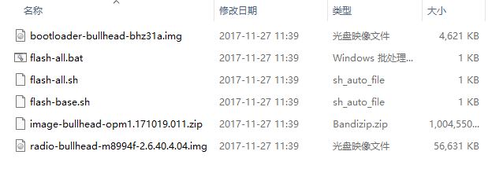
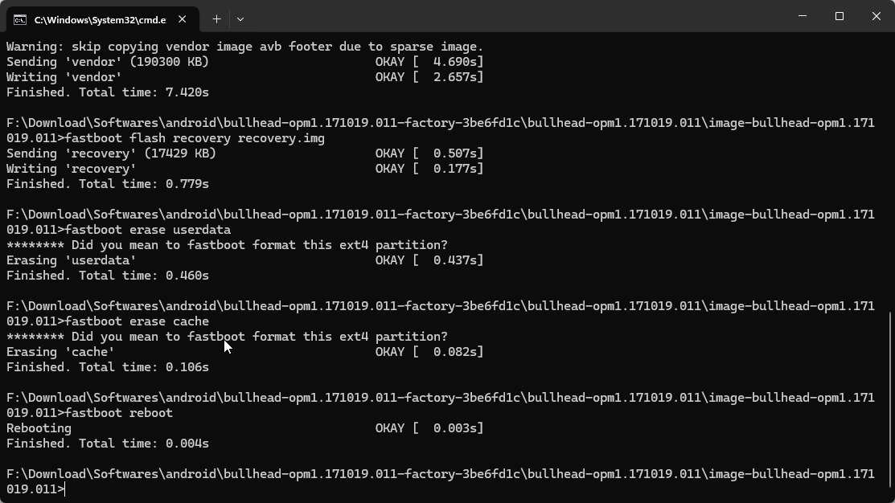

# Chapter-01
The first Chapter include PC and android environments, I want to record the difficult load of begining
with Android Reverse.

I know I need some software and handware to help me study, includes
+ Google Nexu 5s
+ Magisk or SR5-SuperSu-v2.82
+ twrp3.3.0
+ bullhead-opm1.17019.011-factory(Flashable firmware package)
+ nethunter-2024.2

## 1.unzip the bullhead



Choose the sh or bat file to execute based on your operating system.

## 2.Root

Enter the bootloader mode and use fastboot tool to flash the TWRP image into the Recovery partition.

```shell
adb reboot bootloader
fastboot flash recovery twrp
```

Push SuperSU to the sdcard directory of the device.

```shell
adb push SuperSU /sdcard/
```

Enter the TWRP and Install.

### ERROR
when I was execute TWRP installing process, there is a error that mount failed,

so I have to recovery the system image(Nexu 5s).

Enter the fastboot mode.

```shell
fastboot flash system system.img
fastboot flash boot boot.img
fastboot flash vendor vendor.img
fastboot flash recovery recovery.img
fastboot erase userdata
fastboot erase cache
```



## 3.

