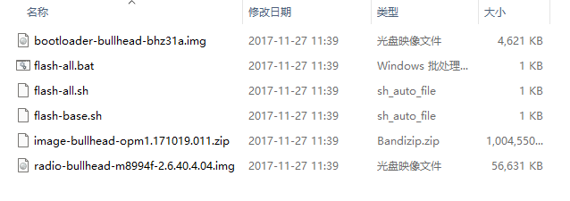

# Chapter-01
第一章包含配置PC和android设备环境，我希望记录下开始安卓逆向的难点以及解决过程。

我知道我需要一些软硬件设施帮助我学习，包含：
+ Google Nexu 5s
+ Magisk or SR5-SuperSu-v2.82
+ twrp3.3.0
+ bullhead-opm1.17019.011-factory(Flashable firmware package)
+ nethunter-2024.2

## 1.解压bullhead压缩包



根据你的操作系统选择sh或bat文件进行执行。

## 2.Root权限

让设备进入bootloader解锁模式并且使用fastboot工具将TWRP镜像包刷入到Recovery分区中。

```shell
adb reboot bootloader
fastboot flash recovery twrp
```

将SuperSU软件压缩包推送到设备的sdcard目录下。

```shell
adb push SuperSU /sdcard/
```

进入TWRP中并下载。

### 碰到错误
when I was execute TWRP installing process, there is a error that mount failed,
当我执行TWRP下载进程时，碰到一个挂载错误提示，所以我不得不恢复系统分区(Nexu 5s).

进入fastboot模式：

```shell
fastboot flash system system.img
fastboot flash boot boot.img
fastboot flash vendor vendor.img
fastboot flash recovery recovery.img
fastboot erase userdata
fastboot erase cache
```


## 3.刷入nethunter2020.03

```shell
adb push nethunter2020.03.zip /sdcard
```
重启进入bootloader模式并使用TWRP软件刷入nethunter

## 4.推送frida-server压缩包到设备上

```shell
adb push frida-server-12.8.0 /data/local/tmp/
```

记得使用chmod命令改变目录权限。

## 总结

写下以上内容能够帮助我厘清并记住关键步骤，以便日后快速回忆并像他人输出讲解。


> [!NOTE] 为什么不能直接用烧录工具刷编译好的镜像？
> 原因本质是：设备 Bootloader 锁、安全策略、分区布局和格式不兼容

> 官网烧录工具一般只支持fastboot官方格式
> Bootloader是设备启动前加载系统的引导程序，负责初始化硬件并引导进入操作系统或recovery。
> 设备bootloader安全机制阻止非官方方式刷入系统，例如小米会强制校验系统签名，尤其是boot、vbmeta、dbto等分区。
> 而使用TWRP可以跳过这些验证，并按照镜像包(LineageOS)要求安全刷入每个分区。


