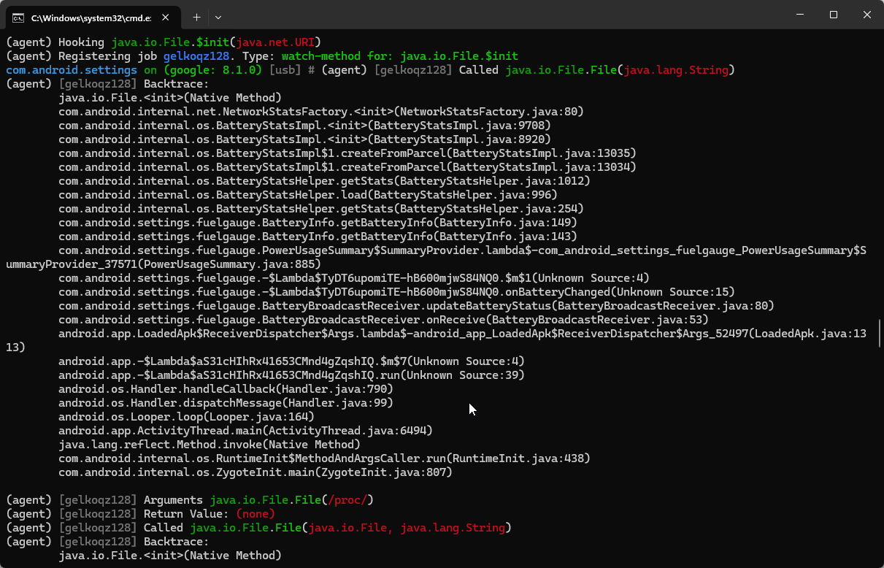

# Objection快速逆向入门

Objection支持Android和IOS，是一款Hook框架Frida。

frida-ps -U | grep settings 通过frida-ps找到对应的App及包名

objection -g com.android.settings explore 注入


1. help xx : 出现当前命令的解释信息
    + help env 

2. jobs : 查看和管理当前Hook执行的内容
3. frida : 查看Frida相关信息

    

4. 内存漫游指令。

    + android hooking list classes : 列出内存中的所有类，内存中已加载的类会非常多，不筛选的话完全看不了。
  
    
    
    + android hooking search classes <classname> : 搜索包含特定关键词的类。
    
    

    + android hooking search methods <key> : 搜索包含关键词key的方法。内存中已加载的方法是已加载的类的数倍，搜索会非常耗时间。
  
    

    + android hooking list class_methods <classname> : 在搜索到我们感兴趣的类后，用该命令查看该类中的所有方法。
  
    

    + android hooking list activities/services : 列出进程所有的活动/服务。

     

    + android hooking watch class_method <methodname> : 对指定方法进行Hook
    
        ``` frida
        eg. android hooking watch class_method java.io.File.$init --dump-args --dump-backtrace --dump-return
        ```

         

    + android hooking watch class <classname> : 对指定类名中的所有函数的Hook
       
        ``` frida
        eg. android hooking watch class java.io.File
        ```

         


    + android heap : 主动调用在Objection中的使用

        1. 基于最简单的Java.choose的实现（搜索实例）

            对实例的搜索在Objection是使用以下命令实现的 : android heap search instances <classname>.
            以java.io.File类为例，搜索到很多File实例，并且打印出对应的Handle和toString的结果。

            ``` frida
            eg. android heap search instances java.io.File
            ```

             


        2. 调用实例方法有两种。

            第一种使用以下命令调用实例方法 ： android heap execute <Handler> <methodname> , 这里的实例方法指的是没有参数的实例方法。
        
            ```frida
            eg. android heap execute 0x3606 getPath
            ```

             


            使用execute执行带参函数会报错，如果要执行带参函数，则需要先执行以下命令：

            ```frida
            android heap evaluate <Handle>
            ```

             

            heap evaluate 既可以执行有参函数，也可以执行无参函数。


## 反编译工具

介绍一下你可能会用到的工具。

+ Jadx
+ Jeb
+ GDA

## Operation Begining

1. Cannot connect USB?
    Termux. A software which can perform terminal on Android device.

    To solve how to start frida-server without adb on PC device.

    Otherwise, Objection support to use Network Connection, it can listen to Android port.

    You can use 'netstat' command to view the port which frida-server use.

    ```shell
    netstat -tulp | grep frida
    ```

    After seeing it, use Objection command.

    ```frida
    objection -N -h xxx.xxx.xxx.xxx -p 8888 -g com.example.packagename explore
    
    -N : Network Listen Model
    ```

2. Traverse services

    ```frida
    android hooking list services
    ```

    The above code will iterate over services.

    But we cannot see which function cause the phenomena. So we should hook the whole service class.
3. Hook MyServiceOne Class

    ```frida
    android hooking watch class com.example.MyServiceOne
    ```

    Then you can find that MyServiceOne.access$L1000018 Method is called.

    Use Jeb to find the corresponding function.

    ```java
    public void run(){
        ...
        Object v1 = MyServiceOne.this.getSystemService("audio");
        // set the max volume
        v1.setStreamVolume(3,v1,getStreamMaxVolunme(3),4);
        v1.getStreamMaxVolume(0);
        v1.getStreamMaxVolume(0);
        MyServiceOne.this.getApplication()
                    .getSystemService("vibrator")
                    .vibrate(new long[]{((long)100),((long)1500),((long)100),((long)1500),-1})
        ...
    }
    ```

    Then you know what make the voice noise. And then we touch the unlock logic.

4. UnLock Button？

    when you click unlock button, you will find some functions are called.
    Following the principle that the function printed first is called first, we will hook a method instead of the whole class methods.

    ```frida
    android hooking watch class_method com.example.MyServiceOne.xxxmethod --dump-args --dump-backtrace --dump-return
    dump-args : print arguments
    dump-backtrace : print heap trace
    dump-return : print function return value
    ```

    TIPS: the backtrace content perform that functions printed first is called last.

    Finally, we can summarized that use Objection can help us localize the important code.

## frida development philosophy

1. Objection Assisted localization

    ```frida
    // list activities
    android hooking list activities

    // install and traverse all activity later start corresponding activity
    android intent launch activity com.example.CaculatorActivity

    // verify if the function exists
    android hooking list class_methods com.example.CalculatorActivity

    // hook the method
    android hooking watch class method com.example.CalculatorActivity.caculate --dump-args --dump-backtrace --dump-return
    ```

    We can see the origin code and find that the calculate function use the sub function of Arith class.

    To verify whether the sub function is called, we try to test.

    First, iterate the class.

    ```frida
    android hooking list classes
    ```

    Tips: Before running the objection to inject App, checkout to `~/.objection` directory

    clear the old `objection.log`. After that, re-inject App and run the traverse code.

    Finally you will find Arith Class in the memory.

    Second, hook the sub function.

    ```frida
    android hooking watch class_method com.example.xxx.sub --dump-args --dump-backtrace --dump--return
    ```

    you will find the sub function overloads.

    Third, use firda scripts to modify parameters and actively invoke.

    ```frida
    function main(){
        Java.perform(function(){
            var Arith = Java.use("com.example.xxx.Arith)
            Arith.sub.overload('java.lang.String','java.lang.String').implementation = function(str,str2){
                var result = this.sub(str,str2)
                console.log('result=>',result)
                console.log(Java.use("android.util.log")
                            .getStackTraceString(Java.use("java.lang.Trowable))
                            .$new()))
                return result
            }
        })
    }
    ```
