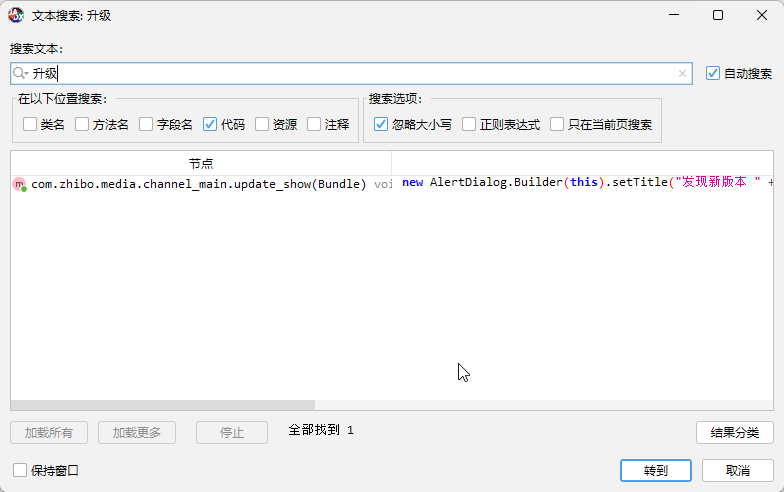

# App security offence and defense process

This section introduces the upgrade pop-up prompt of an unprotected app.

## Practical analysis and cracking of an unprotected app

In Android, there are three main comman ways to implement pop-ups:

1. android.App.Dialog
2. android.App.AlertDialog
3. android.widget.PopupWindow

To find the upgrade dialog, decompile source code and search for relevent characters, like this:



use frida to inject:

```frida
android heap searrch instances android.App.AlertDialog
android heap searrch instances android.App.Dialog
android heap searrch instances android.wdiget.PopupWindow
```

Recommand an Objection plugin - Wallbreaker, which enhances Objection's 
memory search functionality  with practical examples.

```frida
objection -g com.hd.zhibo explore -P /plugins/

plugin wallbreaker objectionsearch android.app.AlertDialog
# print: [0x2582] xxx

plugin wallbreaker objectdump 0x2582
# The text content displayed in the upgrade prompt pop-up.
```

But sorry, the com.hd.zhibo App has already outdate and is no longer maintained.So I can't screencap any picture.

Since the Hook has no effect if triggered after the function call, and the sample app's 
upgrade prompt pops up as soon as the app enters the main page, it's necessary to ensure
that the sample is hooked as soon as the startup function is invoked，so

```frida
objection -g com.hd.zhibo explore -s "android hooking watch class android.App.AlertDialog"
```

Then you will find that some functions is invoked, like

```frida
[xxx] Called android.App.AlertDialog.resolveDialogTheme
[xxx] Called android.App.AlertDialog.resolveDialogTheme
[xxx] Called android.App.AlertDialog.onCreate
```

After testing, choose onCreate function to hook and print stack trace.

```frida
android hooking watch class_method adnroid.App.AlertDialog.onCreate --dump-args --dump-backtrace --dump-return
```


