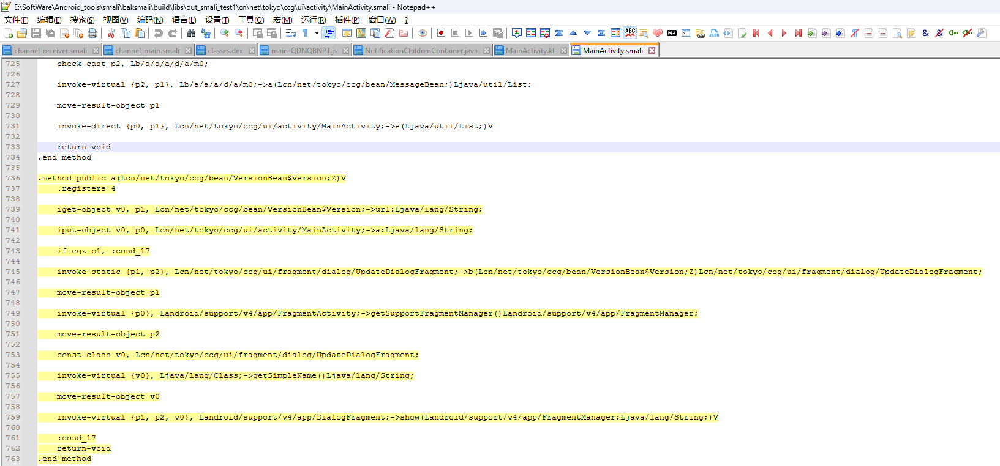
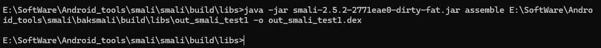

# Chapter5 App 攻防博弈过程

通过两个简单 App 来演示 App 攻防的博弈过程。

## 5.1 App 攻防技术演进

APK 文件通过 zip 被解压缩后会发现多了一个 class.dex 文件，这个正是 Android 系统虚拟机的可执行文件。

resources.arsc 文件，该文件是用于资源文件相关信息的文件。

META-INF 文件夹主要用于存储签名文件的。

当我们试图像打开源码那样打开解压后 App 的各类文件，会发现乱码，那是因为 APK 文件虽然是压缩包的格式，但是内部的每个文件都被编译为二进制了。

Smail 语言可以看作是 Android 虚拟机的汇编语言。

攻 : 2010 年，Android 病毒与 ApkTool 反编译神器同年出现。Jadx 和 Jeb 是基于 apkTool 进一步优化的成果。

攻 : 为了应对 apkTool 反编译没有保护的 app，方式是代码混淆比如 Google 自带的 ProGuard 混淆器。

防 : 随后是动态加载方案，将需要进行保护的代码单独编译成一个二进制文件，将其加密后放到外部的二进制文件中。
在外部程序运行的过程中，再将被保护的二进制代码解密并使用 ClassLoader 加载到内存中。还有的甚至是把重要功能和数据放在云端，App 只做展示数据功能。

攻 : 动态分析通过附加调试或者注入进程来进行分析比如 Hook 或 trace。

防 ：针对动态分析方法有两种方法：运行时检测和事先阻止。demo02 进程 PID 在被附加时会变成 android_server64 的进程 PID。
通过判断系统进程是否存在 Server 相关的进程名进行检测；针对调试器通过指令执行时间差进行检测；事先预防双进程保护。

防 ：App 加固，用加固厂商的壳程序包裹真实的 App，在真实运行时再通过壳程序执行释放真正 App。
加固总结为 3 个阶段：DEX 整体加固、代码抽取保护、将 Java 代码变成最终的 Native 层代码。

防 ：进一步保护 native 代码，LLVM 是一套开源的编译器，OLLVM 是专门为混淆而生的 LLVM。

## 5.2 Smail 语言介绍

| Smail 数据类型 | Java 中数据类型 |
| -------------- | --------------- |
| B              | byte            |
| S              | short           |
| I              | int             |
| J              | long            |
| F              | float           |
| D              | double          |
| Z              | boolean         |
| C              | char            |
| V              | void            |

### 类名

```
public class MainActivity extend AppCompatActivity{}

.class public xx/xx/xx/MainActivity
.super xx/xx/xx/AppCompatActivity
.source "MainActivity.java"
```

### 变量

```
private String total = "hello"

.field private total:xx/xx/String
```

### 变量

```
.method <访问权限> [修饰关键字] <方法原型>
    <.locals/.registers>
    [.param]
    [.line]
    <代码>
.end method
```

## 对未加固 App 进行分析和破解实战

介绍去除一个未加固 App 的升级提示弹窗，主要有三种弹窗类型。

```
android.App.Dialog
android.App.AlertDialog
android.widget.PopupWindow
```

为了找到升级弹窗是哪种类型，反编译源码和寻找相关的代码。


用 frida 去注入试试：

```shell
android heap search instances android.App.AlertDialog
android heap search instances android.App.Dialog
android heap search instances android.wdiget.PopupWindow
```

比起用 frida 中的 heap search 来寻找内存实例，推荐使用 Wallbreaker，
不仅实现了内存搜索功能，还能通过类实例打印相印的内容。

```shell
# use in windows
objection -g com.hd.zhibo explore -P ./plugins/

plugin wallbreaker objectionsearch android.app.AlertDialog
# print: [0x2582] xxx

plugin wallbreaker objectdump 0x2582
# The text content displayed in the upgrade prompt pop-up.
```

由于 zhibo.apk 的服务器地址已经失效，出现不了升级弹窗。

因为如果在函数调用之后才触发 Hook 是无效的，而示例 App 的升级弹窗会在进入主页面后立刻弹出，所以必须确保在启动函数一被调用时就进行 Hook。

```shell
objection -g com.hd.zhibo explore -s "android hooking watch class android.app.AlertDialog"
```

Then you will find that some functions is invoked, like


在测试时选择 onCreate 函数去 Hook 并且打印堆栈。

```shell
android hooking watch class_method android.app.AlertDialog.onCreate --dump-args --dump-backtrace --dump-return
```

你可以找到升级显示函数，接下来通过修改 Smali 汇编代码。

1. 用 apktool 工具反编译 app

在反编译后， 找到 channel_main 类对应的 Smali 文件及 update_show()函数在文件中的位置：


2. 修改 Smali 代码

修改'if-eqz p1, :cond_0'为'if-nez'。

用下列命令来重打包修改过的 apk。

```shell
apktool b zhibo
```


1. 签名 App

我们需要使用 jarsigner 或者其他 Android 认可的签名工具生成一个签名文件，使用其对打包好的 apk 进行签名。

```shell
keytool -genkeypair -alias abc -keyalg RSA -keystore E:\Project\ASCD\AndroidFridaBeginnersBook\Chap05\zhibo\dist\abc.keystore
```


```shell
jarsigner -verbose -keystore E:\Project\ASCD\AndroidFridaBeginnersBook\Chap05\zhibo\dist\abc.keystore -signedjar zhibo_patch.apk zhibo.apk abc
```


4. 最后重新下载 apk

## 对加固 App 进行逆行分析和破解的实战

'app' : com.hello.qqc.apk

上个案例 App 在手动跳过欢迎页后会弹出升级提示弹窗，该案例不管如何点击窗口外部的位置都无法消除弹窗。

### 搜索关键类

与上个案例类似，在弹窗出现在内存中后搜索相关类的实例。

```shell
plugin wallbreaker objectsearch android.app.AlertDialog
plugin wallbreaker objectsearch android.app.Dialog
plugin wallbreaker objectsearch android.widget.PopupWindow
```


### Hook 注入

进一步验证值得怀疑的类的注入：

1. 在主页面未进入时分别使用 watch class 的方式 Hook 相关类，然后根据被调用的记录判定是否使用了相关类。

```shell
android hooking watch class android.app.AlertDialog
android hooking watch class android.app.Dialog
android hooking watch class android.widget.PopupWindow
```

你会发现会有很多函数被调用的情况，例如 setCancelable(boolean)函数

1. Hook 钩住 setCalcelable 函数

```shell
android hooking watch class_method android.app.Dialog.setCancelable --dump-args --dump-backtrace --dump-return
```


你可以看到'cn.net.tokyo.ccg.ui.fragment.dialog.UpdateDIalogFragment.onCreateDialog()'函数。

3. 重打包

为了消除弹窗，还是应该采取重打包的方式进行。与非加固 app 不同，如果使用 Jadx 直接打开 apk 文件，
那么最终只能看到外部壳的一些信息。如何得到真是 App 的 dex 呢？脱壳是唯一选择。

```shell
git clone https://github.com/hluwa/FRIDA-DEXDump
# 上面地址项目不起作用，推荐用下面地址
git clone https://github.com/kenny67/AndroidReverseEngineering.git
```

我们不是通过在注入时添加 -P 参数和插件路径来加载插件，
而是在 Objection 成功注入后，通过 Objection 的 REPL 界面使用 plugin 命令来加载插件。

```shell
# 加载插件
plugin load /plugins/dexdump
# 脱壳
plugin dexdump dump
```


注意查看图中的 dex 文件保存路径，确认 UpdateDialogFragment 类在哪一个 dex 文件中。

Use grep command to identity the dex file that stored the key class UpdateDialogFragment of the app.

```shell
# linux
grep -ril "UpdateDialogFragment" ./*.dex
-r : 嵌套子目录
-i : 忽略大小写
-l : 仅列出包含指定模式匹配的文件名，而不是显示匹配行本身。

# windows
for /r D:\MyFolder %i in (*.dex) do findstr /i /c:"UpdateDialogFragment" "%i" && echo === Found in: %i
```


确定具体的 dex 文件后，使用 Jadx 打开该文件并找到 “UpdateDialogFragment ”方法。

该方法是 DialogFragment 的扩展，有关升级的代码没有在 UpdateDialogFragment 类中显示。


还需要进一步确认是哪里调用该 Dialog 的显示。

```shell
android hooking watch class cn.net.tokyo.ccg.ui.fragment.dialog.UpdateDialogFragment
```


发现'cn.net.tokyo.ccg.ui.fragment.dialog.UpdateDialogFragment.b' 函数被最先调用。

确定目标函数后，针对'cn.net.tokyo.ccg.ui.fragment.dialog.UpdateDialogFragment.b'函数重新进行 Hook。

```shell
android hooking watch class_method cn.net.tokyo.ccg.ui.fragment.dialog.UpdateDialogFragment.b --dump-args --dump-backtrace --dump-return
```


发现'cn.net.tokyo.ccg.ui.activity.MainActivity.a(Unknown Source:6)'在调用它。

使用 Jadx 定位到这个函数。


为什么原本是 a()，在 Jadx 中变成 mo1353a()?

Jadx 遇到混淆的方法名（比如 a()），为了避免同类中多个重名的 a() 方法，它会自动重命名为：

```shell
#  这个是它的命名规则（m = method, o = obfuscated）
mo[索引值]a
```

version 变量决定了弹窗的出现与否，可以修改这个 if 判断语句的条件。

现在的目标是：修改 dump 出的 dex 中某个函数的逻辑，然后重新打包并运行这个 App。

#### 步骤 1：用 baksmali 把 dex 反编译成 smali

你可以从 GitHub 上下载 baksmali，也可以直接使用命令行，生成的可执行文件在 build/libs 目录下:
```shell
git clone https://github.com/JesusFreke/smali.git
cd smali
./gradlew build
```


成功构建出了 baksmali 工具，你最常用的是这个: baksmali-2.5.2-2771eae0-dirty.jar

执行以下命令，将 .dex 文件反编译成 smali 代码：

```shell
baksmali disassemble your.dex -o smali_out/
```

假设你有个 classes.dex，运行命令如下：

```shell
java -jar baksmali-2.5.2-2771eae0-dirty-fat.jar d E:\Project\ASCD\AndroidReverseLearning\com.hello.qqc\0xca35a024.dex -o out_smali_test1
```


#### 步骤 2：编辑 .smali 文件，修改目标函数

得到的 smali_out/ 中会有完整的 smali 文件结构，比如 smali_out/com/xxx/abc/MainActivity.smali

找到'cn.net.tokyo.ccg.ui.activity.MainActivity.a(Unknown Source:6)'对应的smali代码。



修改if-eqz为if-nez:


修改了 smali 代码后，你可以用 smali 工具将它重新编译成 .dex 文件：

```shell
smali assemble output_folder/ -o new.dex
```

```shell
java -jar smali-2.5.2-2771eae0-dirty-fat.jar assemble E:\SoftWare\Android_tools\smali\baksmali\build\libs\out_smali_test1 -o out_smali_test1.dex
``` 



生成的文件如下：


### 对加固 App 重打包

由于该 App 是加固的，因此在重打包过程中还有一些需要注意的地方：

1. 重打包时应该使用脱壳后原始 App 的 dex 替换掉原来的壳 dex。

2. App 在加固后的入口点变成了壳的入口点，因此在重打包之后还需要修改 AndroidManifest 的入口类。

为了解决第一个问题，需要在使用 apktool 反编译 APK 时选择不反编译 dex 文件并删除壳的 dex，
而 apktool 的-s 参数就提供了不反编译 APK 中 dex 文件的功能，apktool 的反编译结果如下：

```shell
apktool d com.hello.qqc.apk -s
```


反编译文件结果如图所示：


反编译完成后，删除原始 classes.dex 并将脱壳后的 dex 文件并将脱壳后的dex文件按照文件大小依次
命名为classes.dex、classes2.dex、classes3.dex、classes4.dex，并存储到壳的dex所在的目录。复制完所有
脱壳后dex的反编译目录和文件如图所示：


在完成上述操作后，第一个问题就解决了。此时还需要解决第二个问题——修改App入口类。

为此，在Jadx中重新打开包含关键类的dex文件，并搜索extends Application的代码：


定位到'cn.net.tokyo.ccg.base.App'后，将反编译结果目录下AndroidManifest.xml清单文件中
<Application>节点中android:name对应的值修改为找到的完整类名，AndroidManifest文件中的部分内容如图所示：


修改完成后，可以使用如下命令对apktool反编译的结果目录重新进行编译。

```shell
apktool b com.hello.qqc
```


重新编译的apk文件会存放在com.hello.qqc/dist目录下，如下图所示：


对apk文件进行重签名：


# 总结

跟着一步步流程走下来，我最大的感受是，我从看山是山到看山不是山再回到看山还是山的境地，我的认知
是螺旋缓慢式上升，看(书)是必要的，跟着做也更加重要，要知识与行动合一。


