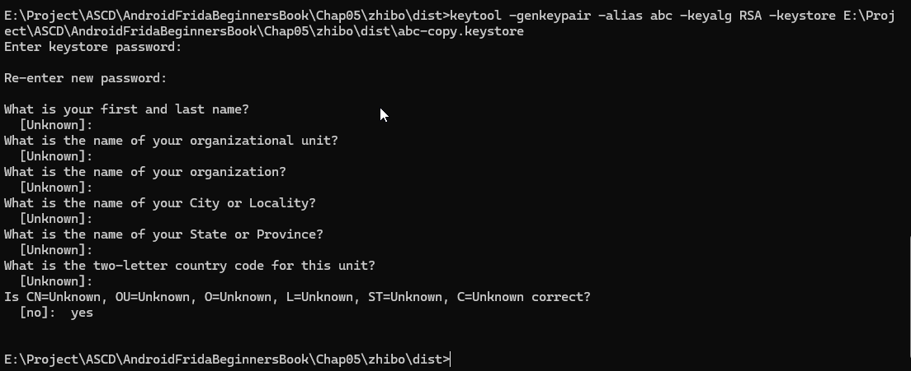
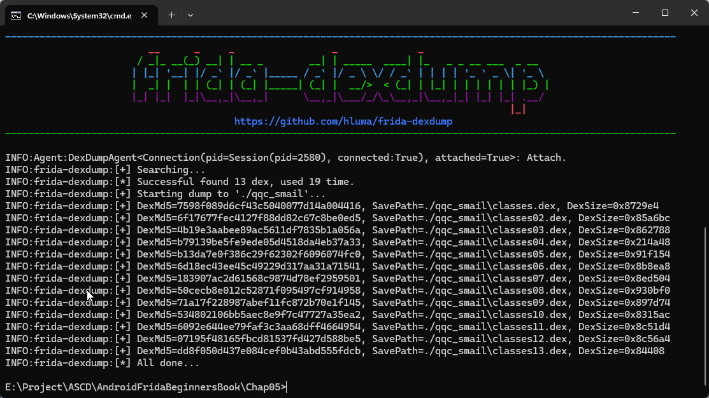

# Chapter5 App攻防博弈过程

通过两个简单App来演示App攻防的博弈过程。

## 5.1 App攻防技术演进

APK文件通过zip被解压缩后会发现多了一个class.dex文件，这个正是Android系统虚拟机的可执行文件。

resources.arsc文件，该文件是用于资源文件相关信息的文件。

META-INF文件夹主要用于存储签名文件的。

当我们试图像打开源码那样打开解压后App的各类文件，会发现乱码，那是因为APK文件虽然是压缩包的格式，但是内部的每个文件都被编译为二进制了。

Smail语言可以看作是Android虚拟机的汇编语言。

攻 : 2010年，Android病毒与ApkTool反编译神器同年出现。Jadx和Jeb是基于apkTool进一步优化的成果。

攻 : 为了应对apkTool反编译没有保护的app，方式是代码混淆比如Google自带的ProGuard混淆器。

防 : 随后是动态加载方案，将需要进行保护的代码单独编译成一个二进制文件，将其加密后放到外部的二进制文件中。
在外部程序运行的过程中，再将被保护的二进制代码解密并使用ClassLoader加载到内存中。还有的甚至是把重要功能和数据放在云端，App只做展示数据功能。

攻 : 动态分析通过附加调试或者注入进程来进行分析比如Hook或trace。

防 ：针对动态分析方法有两种方法：运行时检测和事先阻止。demo02进程PID在被附加时会变成android_server64的进程PID。
通过判断系统进程是否存在Server相关的进程名进行检测；针对调试器通过指令执行时间差进行检测；事先预防双进程保护。

防 ：App加固，用加固厂商的壳程序包裹真实的App，在真实运行时再通过壳程序执行释放真正App。
加固总结为3个阶段：DEX整体加固、代码抽取保护、将Java代码变成最终的Native层代码。

防 ：进一步保护native代码，LLVM是一套开源的编译器，OLLVM是专门为混淆而生的LLVM。

## 5.2 Smail语言介绍

| Smail数据类型  | Java中数据类型 |
| --------------| ------------- |
|      B        |      byte     |
|      S        |      short    |
|      I        |      int      |
|      J        |      long     |
|      F        |      float    |
|      D        |      double   |
|      Z        |      boolean  |
|      C        |      char     |
|      V        |      void     |

### 类名

```
public class MainActivity extend AppCompatActivity{}

.class public xx/xx/xx/MainActivity
.super xx/xx/xx/AppCompatActivity
.source "MainActivity.java"
```

### 变量

```
private String total = "hello"

.field private total:xx/xx/String
```

### 变量

```
.method <访问权限> [修饰关键字] <方法原型>
    <.locals/.registers>
    [.param]
    [.line]
    <代码>
.end method
```

## 对未加固App进行分析和破解实战

介绍去除一个未加固App的升级提示弹窗，主要有三种弹窗类型。

```
android.App.Dialog
android.App.AlertDialog
android.widget.PopupWindow
```

为了找到升级弹窗是哪种类型，反编译源码和寻找相关的代码。


用frida去注入试试：

```shell
android heap search instances android.App.AlertDialog
android heap search instances android.App.Dialog
android heap search instances android.wdiget.PopupWindow
```

比起用frida中的heap search来寻找内存实例，推荐使用Wallbreaker，
不仅实现了内存搜索功能，还能通过类实例打印相印的内容。

```shell
# use in windows
objection -g com.hd.zhibo explore -P ./plugins/

plugin wallbreaker objectionsearch android.app.AlertDialog
# print: [0x2582] xxx

plugin wallbreaker objectdump 0x2582
# The text content displayed in the upgrade prompt pop-up.
```

由于zhibo.apk的服务器地址已经失效，出现不了升级弹窗。

因为如果在函数调用之后才触发 Hook 是无效的，而示例 App 的升级弹窗会在进入主页面后立刻弹出，所以必须确保在启动函数一被调用时就进行 Hook。

```shell
objection -g com.hd.zhibo explore -s "android hooking watch class android.app.AlertDialog"
```

Then you will find that some functions is invoked, like


在测试时选择onCreate函数去Hook并且打印堆栈。

```shell
android hooking watch class_method android.app.AlertDialog.onCreate --dump-args --dump-backtrace --dump-return
```

你可以找到升级显示函数，接下来通过修改Smali汇编代码。

1. 用apktool工具反编译app

在反编译后， 找到channel_main类对应的Smali文件及update_show()函数在文件中的位置：


2. 修改Smali代码

修改'if-eqz p1, :cond_0'为'if-nez'。

用下列命令来重打包修改过的apk。

```shell
apktool b zhibo
```


1. 签名App

我们需要使用jarsigner或者其他Android认可的签名工具生成一个签名文件，使用其对打包好的apk进行签名。

```shell
keytool -genkeypair -alias abc -keyalg RSA -keystore E:\Project\ASCD\AndroidFridaBeginnersBook\Chap05\zhibo\dist\abc.keystore
```



```shell
jarsigner -verbose -keystore E:\Project\ASCD\AndroidFridaBeginnersBook\Chap05\zhibo\dist\abc.keystore -signedjar zhibo_patch.apk zhibo.apk abc
```


4. 最后重新下载apk

## 对加固App进行逆行分析和破解的实战

'app' : com.hello.qqc.apk

上个案例App在手动跳过欢迎页后会弹出升级提示弹窗，该案例不管如何点击窗口外部的位置都无法消除弹窗。

### 搜索关键类

与上个案例类似，在弹窗出现在内存中后搜索相关类的实例。

```shell
plugin wallbreaker objectsearch android.app.AlertDialog
plugin wallbreaker objectsearch android.app.Dialog
plugin wallbreaker objectsearch android.widget.PopupWindow
```


### Hook

To identify the class responsible for implementing a popup by hooking each suspected popup class,
you could follow these steps:

1. Use 'watch class' way to hook related class before enter the HomePage.

```shell
android hooking watch class android.App.AlertDialog
```


The above code is not userful, no any function is invoked during the process.

```shell
android hooking watch class android.App.Dialog
```


Then, you will find many functions are called, such as 'setCancelable(boolean)' function.

2. Hook setCalcelable function

```shell
android hooking watch class_method android.app.Dialog.setCancelable --dump-args --dump-backtrace --dump-return
```


You can see what call the andoird.App.Dialog is 'cn.net.tokyo.ccg.ui.fragment.dialog.UpdateDIalogFragment.onCreateDialog()' function.

3. Unpack the app

Something was different with the unprotected app.

If you use Jadx to uncompile the protected app, only some class information from the external shell is visible.

The only option is to unpack it, 'Dexdump' is another masterpiece by the author of Wallbreaker.

The basic principle of its unpacking is to perform a brute-force search for data in memory that match the 
DEX format to complete the dumping process.


```shell
git clone https://github.com/hluwa/FRIDA-DEXDump
```

we do not load plugin by adding the -P parameters and plugin path during injection,
instead we load plugin by using plugin command in Objection REPL interface after the Objection injection.

```shell
plugin load /plugins/dexdump
plugin dexdump dump
```

I tried using the plugin command in windows, but it doesn't work. So I only use it in python command.

```shell
pip3 install frida-dexdump
```

CLI arguments base on 'frida-tools', you can quickly dump the foreground application like this:

```shell
frida-dexdump -FU
```

Or specify and spawn app like this:

```shell
frida-dexdump -U -f com.app.pkgname
```

Additionally, you can see in -h that the new options provided by frida-dexdump are:

```shell
-o OUTPUT, --output OUTPUT  Output folder path, default is './<appname>/'.
-d, --deep-search           Enable deep search mode.
--sleep SLEEP               Waiting times for start, spawn mode default is 5s.
```

When using, I suggest using the -d, --deep-search option, which may take more time, but the results will be more complete.




All the unpacked files were saved in the specified SavePath.

Use grep command to identity the dex file that stored the key class UpdateDialogFragment of the app.

```shell
grep -ril "UpdateDialogFragment" ./*.dex
-r : recursice
-i : ignore the case sensitivity.
-l : list only the names of files that contain matches for the specified pattern, rather than 
     displaying the matching lines themselves.
```

After determine the specific dex file, use Jadx open it and find 'UpdateDialogFragment' method.

That method extends the DialogFragment, codes about upgrade were not performed in UpdateDialogFragment class.


To further confirm which external function is calling the class.

```shell
android hooking watch class cn.net.tokyo.ccg.ui.fragment.dialog.UpdateDialogFragment
```


It's the cn.net.tokyo.ccg.ui.fragment.dialog.UpdateDialogFragment.b() that is calling that method.


Use Jadx to locale the function.

> [!Note]
> I can't find UpdateDialogFragment in class.dex files which were dump by frida-dexdump in pyhon3.

[Jadx locale a() Picture]

When I see how MainActivity.a() function is calling the UpdateDialogFragment.b(). The version variable 
determines whether the pop-up window appears, so modify the condition in this if statement.

### re-pack 

Since the app is protected, there are additional details to pay attention to during the repackaging process.

1. When repackaging, the dex of original app after unpacking should be used to replace the original shell dex.

    So when using apktool to decompile the APK, choose not to decompile the dex files and delete the shell dex.

    ```shell
    apktool d com.hello.qqc.apk -s
    ```

    -s parameter in apktool provides the function to avoid decompiling dex files in the APKs.

    Delete the original classes.dex file after decompiling, then rename the dex files by file sizes in sequence as 
    classes.dex, classes2.dex, classes3.dex, classes4.dex and so on, and store them in the directory where the shell
    dex is located. After copying all unpacked dex files, the decompiling directory and files should appear as 
    shown in the image.

2. modify App's entry class

    In Jadx file, search 'extends Application' code, locate 'cn.net.tokyo.ccg.base.App' class.

    [Jadx picture]

    After modifying, use apktool to recompile app.

    ```shell
    apktool b com.hello.qqc
    ```

Then resign, reinstall and execute, you will get the same app without any difference.


