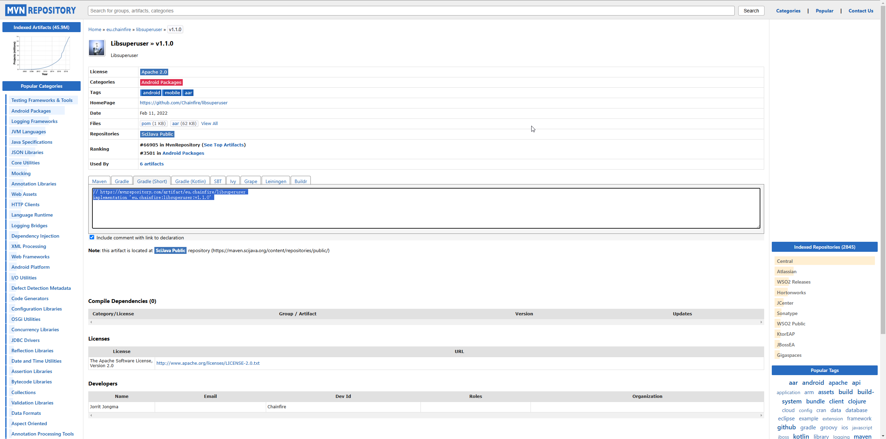

# Chapter6 
    This chapter is used to introduce the Xposed framework.

## Introduce

    As an earlier Hook framework than Frida, Xposed is quite renowned in the Android Sercurity Field.

it was an indispensable tool in the process of App Security Testing before Frida framework emerged.

Plugins developed based on the Xposed framework, such as those for grabbing red envelops, cheating 

in the exercise records, and preventing message retraction for Wechat and QQ, are still popular.

## History Version

    Firstly, search XposedInstaller(3.1.5 version ) on Github and install, but I merely find 

its' android project file instead of direct apk file. So it costs me some time to debug project

especially I undergo difficulties when install Libsuperuser dependency. It's outdated library 

used for managing root permission in Android. There are three version of Libsuperuser in Maven 

Repository as follows.

