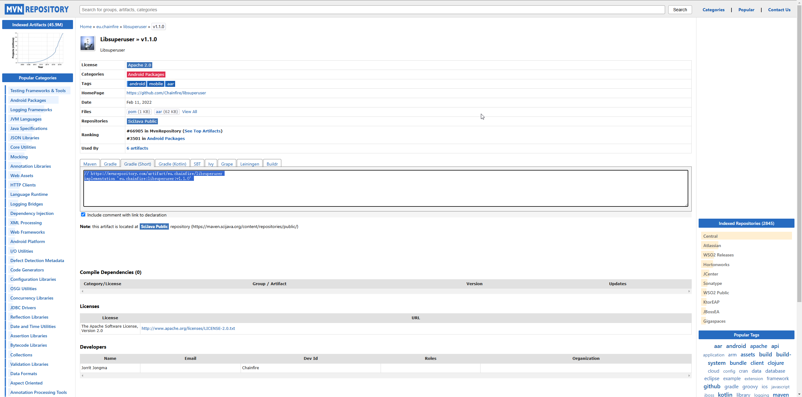
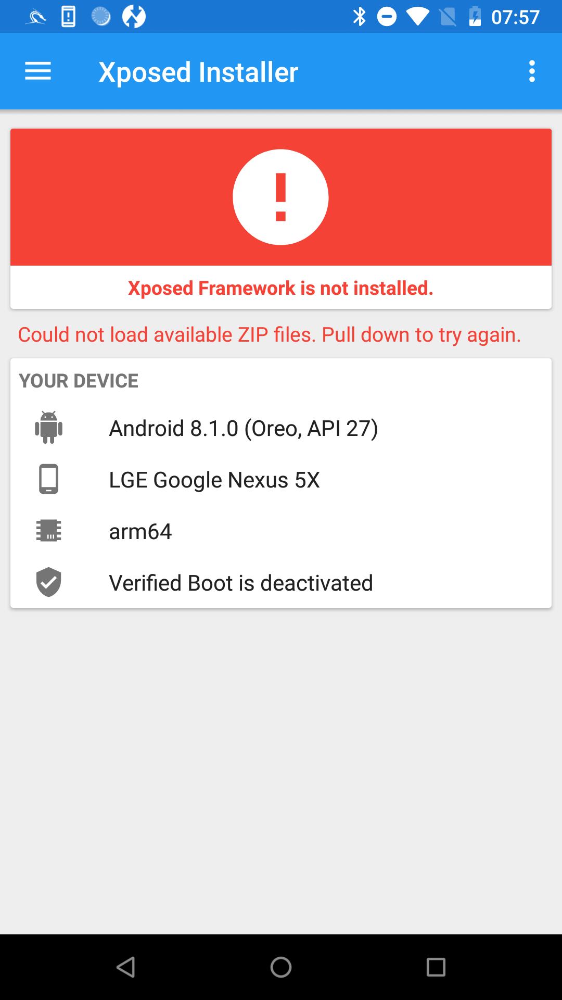

# Chapter6

    This chapter is used to introduce the Xposed framework.

## Introduce

    As an earlier Hook framework than Frida, Xposed is quite renowned in the Android Sercurity Field.

it was an indispensable tool in the process of App Security Testing before Frida framework emerged.

Plugins developed based on the Xposed framework, such as those for grabbing red envelops, cheating

in the exercise records, and preventing message retraction for Wechat and QQ, are still popular.

## History Version

    Firstly, search XposedInstaller(3.1.5 version ) on Github and install, but I merely find

its' android project file instead of direct apk file. So it costs me some time to debug project

especially I undergo difficulties when install Libsuperuser dependency. It's outdated library

used for managing root permission in Android. There are three version of Libsuperuser in Maven

Repository as follows.



Finally, I fail to intall Xposed on APK.



## Plugin Development

    Xposed Framework just provides a convenient interface as far as Frida do. Specially, modifying system

or app functionalities still requires various plugins.

1. Init

   Create a empty android project. Prepare to hook 'String fun(String x)' function.

   Switch to the Project view, modify 'AndroidManifest.xml' file under the 'app/src/main' directory

and add the following code before the <activity android:name=".MainActivity"> tag as shown.

    ```java
        <meta-data 
            android:name="xposedmodule"
            android:value="true">
        <meta-data 
            android:name="xposeddescription"
            android:value="It's a Xposed plugin">
        <meta-data 
            android:name="xposedminversion"
            android:value="53">
    ```

    'meta-data' tag with name xposedmodule should have its corresponding value set to true, this marks

the application as the Xposed module; Tag with name xposeddescription marks the corresponding description
 
of Xposed module; Tag with name xposedminversion marks the min version as it supports.

    Then use USB to connect Android device and install this app.

2. Import dependency

    Import the third-party Xposde API JAR file, XposedBridge.jar.

    ```java
    compileOnly 'de.robv.android.xposed:api:82'
    ```

3. Write the real Hook code

    Xposed implement Hook by IXpsedHookLoadPackage interface. You should rewrite functions.

    ```java
        void handleLoadPackage(XC_LoadPackage.LoadPackageParam laodPackageParam)
        void beforeHookedMethod(MethodHookParam param)
        void agterHookedMethod(MethodHookParam param)
    ```

4. Create init file for Xposed module

    It's necessary to create init file that Xposed can be identified.


