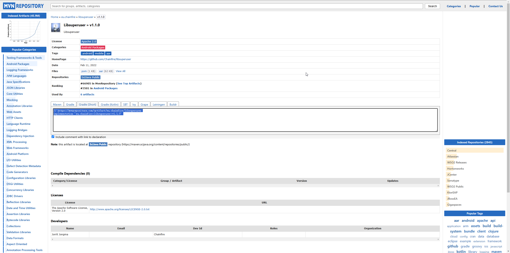

# Chapter6

介绍Xposed框架。

## 介绍

作为比 Frida 更早出现的 Hook 框架，Xposed 在 Android 安全领域颇有声誉。

在 Frida 框架出现之前，它是 App 安全测试过程中不可或缺的工具。

基于 Xposed 框架开发的插件，例如用于微信和 QQ 的抢红包、运动记录作弊、消息防撤回等，至今仍然很受欢迎。

## 历史版本

Xposed最后的发行版是v89，发行时间是2017年12月18日.


查看相应代码提交记录，这个版本是配的是Nougat代号的Android.


查看Android提供的'代号、标记和Build号'对照表可以知道这个版本对应的Android版本为7.1和7.0:


对于Oreo版本， SDK26是给Android8.0, SDK27是给Android8.1.


另外，每次编写Xposed模块代码都需要重启才能生效，这是非常低效的，所以他被用于一些持久化的场景，
例如自动抢红包、去掉其他App中的弹窗等等。

但目前出来很多Xposed的衍生品，例如EdXposed，它在Xposed基础上的Xposed模块不用修改任何API就可以直接在高版本上
基于EdXposed框架执行。


除此之外，还有太极框架、VirtualApp以及Ratel等。

## Xposed框架安装与插件开发

首先，在 GitHub 上搜索 XposedInstaller（3.1.5 版本） 并尝试安装，但我只找到了它的 Android 项目文件，而没有直接的 APK 文件。

所以我花了一些时间来调试这个项目，尤其是在安装 Libsuperuser 依赖时遇到了一些困难。

它是一个已经过时的库，用于在 Android 中管理 root 权限。

在 Maven 仓库中，这个库共有三个版本，如下所示：




我在XposedInstaller APK上下载Xposed失败，还没有分析原因。


Xposed Framework just provides a convenient interface as far as Frida do. Specially, modifying system

or app functionalities still requires various plugins.

1. Init

   Create a empty android project. Prepare to hook 'String fun(String x)' function.

   Switch to the Project view, modify 'AndroidManifest.xml' file under the 'app/src/main' directory

and add the following code before the <activity android:name=".MainActivity"> tag as shown.

    ```java
        <meta-data 
            android:name="xposedmodule"
            android:value="true">
        <meta-data 
            android:name="xposeddescription"
            android:value="It's a Xposed plugin">
        <meta-data 
            android:name="xposedminversion"
            android:value="53">
    ```

    'meta-data' tag with name xposedmodule should have its corresponding value set to true, this marks

the application as the Xposed module; Tag with name xposeddescription marks the corresponding description
 
of Xposed module; Tag with name xposedminversion marks the min version as it supports.

    Then use USB to connect Android device and install this app.

2. Import dependency

    Import the third-party Xposde API JAR file, XposedBridge.jar.

    ```java
    compileOnly 'de.robv.android.xposed:api:82'
    ```

3. Write the real Hook code

    Xposed implement Hook by IXpsedHookLoadPackage interface. You should rewrite functions.

    ```java
        void handleLoadPackage(XC_LoadPackage.LoadPackageParam laodPackageParam)
        void beforeHookedMethod(MethodHookParam param)
        void agterHookedMethod(MethodHookParam param)
    ```

4. Create init file for Xposed module

    It's necessary to create init file that Xposed can be identified.


