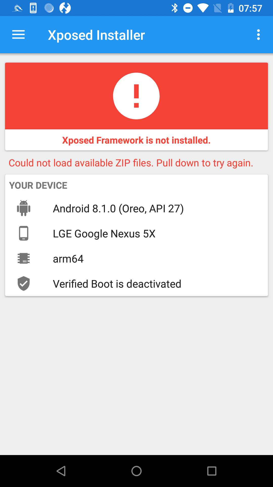

# Chapter6

介绍 Xposed 框架。

## 介绍

作为比 Frida 更早出现的 Hook 框架，Xposed 在 Android 安全领域颇有声誉。

在 Frida 框架出现之前，它是 App 安全测试过程中不可或缺的工具。

基于 Xposed 框架开发的插件，例如用于微信和 QQ 的抢红包、运动记录作弊、消息防撤回等，至今仍然很受欢迎。

## 历史版本

Xposed 最后的发行版是 v89，发行时间是 2017 年 12 月 18 日.


查看相应代码提交记录，这个版本是配的是 Nougat 代号的 Android.


查看 Android 提供的'代号、标记和 Build 号'对照表可以知道这个版本对应的 Android 版本为 7.1 和 7.0:


对于 Oreo 版本， SDK26 是给 Android8.0, SDK27 是给 Android8.1.


另外，每次编写 Xposed 模块代码都需要重启才能生效，这是非常低效的，所以他被用于一些持久化的场景，
例如自动抢红包、去掉其他 App 中的弹窗等等。

但目前出来很多 Xposed 的衍生品，例如 EdXposed，它在 Xposed 基础上的 Xposed 模块不用修改任何 API 就可以直接在高版本上
基于 EdXposed 框架执行。


除此之外，还有太极框架、VirtualApp 以及 Ratel 等。

## Xposed 框架安装

首先，在 GitHub 上搜索 XposedInstaller（3.1.5 版本） 并尝试安装，但我只找到了它的 Android 项目文件，而没有直接的 APK 文件。

所以我花了一些时间来调试这个项目，尤其是在安装 Libsuperuser 依赖时遇到了一些困难。

它是一个已经过时的库，用于在 Android 中管理 root 权限。

在 Maven 仓库中，这个库共有三个版本，如下所示：


我在 XposedInstaller APK 上下载 Xposed 失败，还没有分析原因。



## Xposed 插件开发

Xposed 框架与 Frida 类似，只是提供了便捷的界面。具体来说，修改系统或应用功能仍然需要各种插件。

1. 开始

   创建一个空的 Android 项目。准备钩住“String fun(String x)”函数。

   切换到“项目”视图，修改“app/src/main”目录下的“AndroidManifest.xml”文件

   并在<activity android:name=".MainActivity">标签前添加以下代码，如图所示。

   ```java
       <meta-data
           android:name="xposedmodule"
           android:value="true">
       <meta-data
           android:name="xposeddescription"
           android:value="It's a Xposed plugin">
       <meta-data
           android:name="xposedminversion"
           android:value="53">
   ```

   名为 xposedmodule 的“meta-data”标签应将其对应值设置为 true，这将标记该应用为 Xposed 模块；

   名为 xposeddescription 的标签标记 Xposed 模块的对应描述；

   名为 xposedminversion 的标签标记其支持的最低版本。

   然后使用 USB 连接 Android 设备并安装此应用程序。运行该 App，你会在 XposedInstaller 应用后，选择‘模块’即可看到这个 Xposed 模块。

2. 引入依赖

   导入第三方 Xposde API JAR 文件 XposedBridge.jar。

   ```java
   compileOnly 'de.robv.android.xposed:api:82'
   compileOnly 'de.robv.android.xposed:api:82:sources'
   ```

3. 创建真正的 Hook 代码

   Xposed 通过 IXpsedHookLoadPackage 接口实现 Hook，需要重写相关函数。

   ```java

   public class HookTest implements IXposedHookLoadPackage{
       void handleLoadPackage(XC_LoadPackage.LoadPackageParam laodPackageParam) throws Throwable{

           if(loadPackageParam.packageName.equals("com.roysue.demo02")){
               XposedBridge.log(loadPackageParam.packageName+" has Hooked");
               Class clazz = laodPackageParam.classLoader.loadClass("com.roysue.demo02.MainActivity");
               XposedHelpers.findAndHookMethod(clazz,
                       "fun",
                       String.class,
                       new XC_MethodHook(){
                           void beforeHookedMethod(MethodHookParam param) throws Throwable{
                               super.beforHookedMethod(param);
                               XposedBridge.log("input : "+ param.args[0]);
                           }
                           void afterHookedMethod(MethodHookParam param) throws Throwable{
                                param.setResult("You has been hijacked");
                           }
                       });
           }
       }
   }

   ```

4. 在XposedDemo中添加Xposed模块的入口点

   为了使Xposed框架能够知道哪个函数执行了Hook，点击main文件夹，再依次选择New->Folder->Assets Folders完成assets文件夹的创建。

   在该文件夹中创建一个xposed_init文件，将才创建的Hook类的完整类名写进xposed_init文件中。
