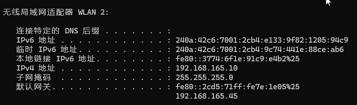
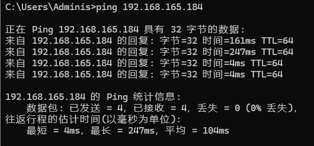
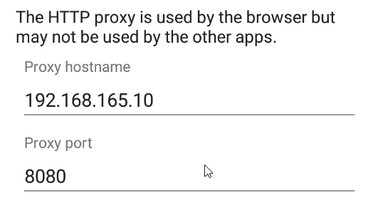
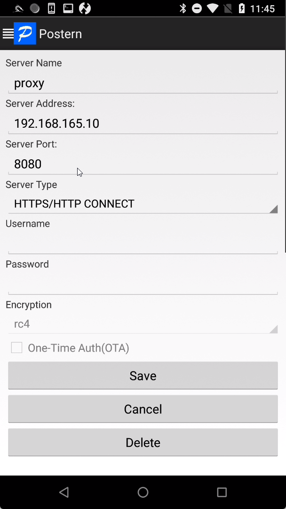
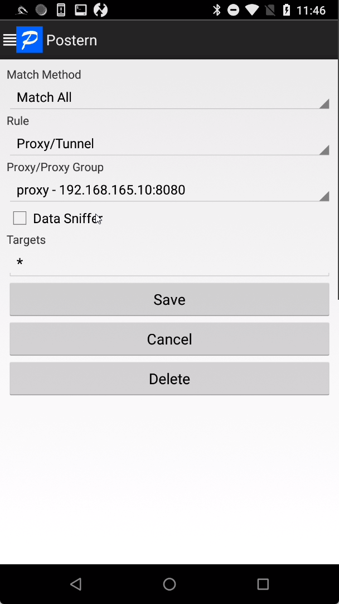
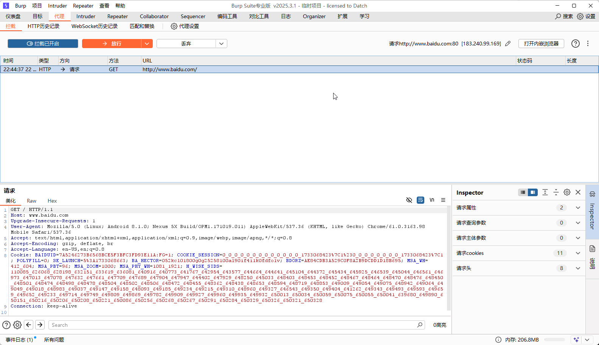
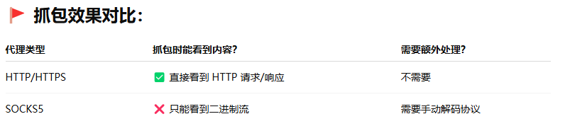
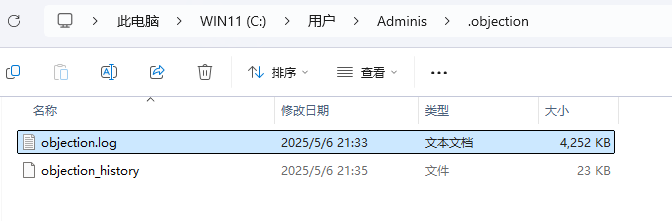
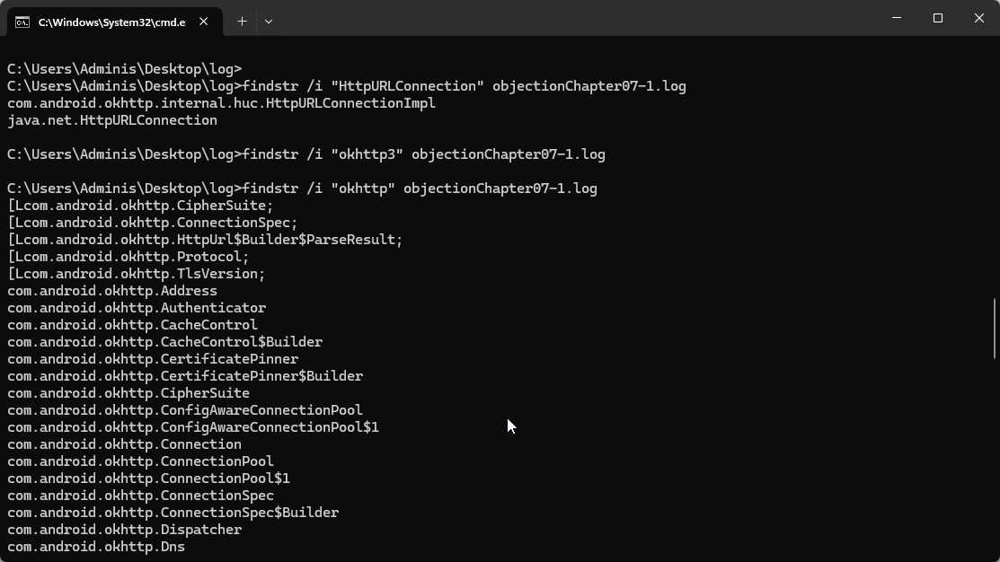
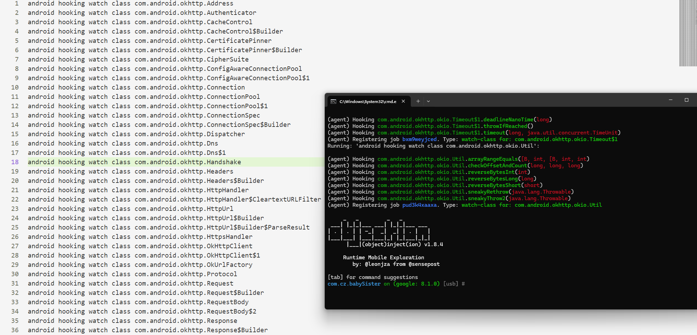

# Chapter7 抓包详解

    介绍http/https搭配抓包工具使用。

    应用层：http(s)抓包协议

    会话层：Socket通信抓包

## Http抓包配置

ifconfig指令查看设备ip,例如192.168.165.184：


ipconfig查看设备ip，例如192.168.165.10：



通过ping测试连通性：



给设备端设置手动代理，配置主机号和端口号：



注意，这种方式很容易被App代码检测或绕过，比如：

```java
System.getProperty("http.proxyHost");
System.getProperty("http.proxyPort");
```

相对于直接从应用层设置WLAN代理的方式，VPN代理则通过虚拟出一个新的网卡，从网络层加上该层代理，比较容易绕过。

这里用postern软件作为示例。

代理配置：



规则配置：



Burp Suite那边配置好监听端口后开启拦截：



Https 的方式我用Burp Suite解决了，尽管不如Fiddle Everywhere那么好用，磕磕盼盼还是勉强成功。

用 HTTP/HTTPS 代理用于 Web 流量调试，如果目标是 浏览器访问网页 → 拦截 & 修改 HTTP 请求/响应。

如果目标是 **一个应用程序通过 TCP socket 直接连服务器 → 想拦截流量， 用 SOCKS5 代理（比如游戏客户端、SSH、BitTorrent）**。

SOCKS5代理：
+ 代理只是 “转发数据” → 不懂 HTTP 协议
+ 不会解包 HTTP 内容 → 只是 TCP/UDP 转发
+ 更像是“隧道” → 抓不到 HTTP 协议结构
+ 用于抓 非HTTP协议 或 任何 TCP 流量



## 应用层抓包核心原理

中间人攻击（Man in the Middle Attack）就是， 客户端传送数据到服务端的中间过程中被一个在链路上的设备
抓取过滤甚至篡改，将完整客户端-服务端通信在客户端与服务端均无感知的情况下分割成客户端-攻击者和
攻击者-服务端两个通信阶段。

Https的整个通信流程被总结为4个阶段：发出请求、身份验证、协商密钥、加密通信。（PS：协商的session-key用于加密通信，节省开销）

为避免通过手动安装系统证书导致App被数据抓包，App推出了相应的对抗手段：
+ ssl pining， 也即客户端对服务端的加强校验，App连系统内置证书也不再信任而只信任App指定的证书。
  相应方法：直接Hook相应证书校验方法。
+ 服务端对客户端的加强校验。在服务端发送session key之前先对客户端的公钥进行校验，如果不是信任的公钥则中断。
  相应方法：由于在服务端，通过逆向分析拿到证书及证书密码，导入到Charles中，让服务端相信其就是客户端。

## Hook模拟抓包

用moveTV.apk(com.cz.babySister)作为示例，首先删除旧的objection.log文件，旧的目录如下：



删除成功后，运行'android hooking list classes' 获取App已加载的所有类。

exit命令退出objection，将objection.log改名为objectionChapter07-1.log并保存在其他地方。

```shell
# linux
cat objectionChapter07-1.log | grep -i okhttp

# windows
findstr /i "okhttp" objectionChapter07-1.log
```

使用上述命令过滤HTTPURLConnection和okhttp(3)相关类:



过滤后把内容导入2.txt文本文件中，objection explore --help会提示使用-c参数执行指定文件中的Objection命令。

```shell
objection -g com.cz.babySister explore -c 2.txt
```


> [!NOTE] 
> Hook太多可能导致崩溃，可以把文本文件分成几份进行Hook

> [!TIP]
> 2025年5月14号时移动TV服务器已经无效，所以在发起网络请求时并没有收到reponse响应消息
> 估计只有404 NOT FOUND


如果按照正常情况，我能在点击登陆后打印出被调用的函数，比如'com.android.okhttp.internal.http.RealResponseBody.source()'函数

```shell
android hooking watch class_method com.android.okhttp.internal.http.RealResponseBody.source
--dump-args --dump-backtrace --dump-return
```

最终定位到App中关键的网络数据包发送函数是‘com.cz.babySister.c.a.a'函数。

对定位到的函数进行Hook得到结果不管是网络请求地址还是用户名和密码都清晰可见。

从这个案例，**通过过滤网络框架的关键字的批量Hook对快速定位App中收发数据包的帮助是巨大的**。

但是以上有个弊端：**如果App本身使用第三方网络请求框架并且本身使用强度非常大的混淆，那么Hook定位抓包就失效了。**

这里介绍一个能够完成混淆后的okhttp Hook的项目：okhttpLogger-Frida，

在这个项目中，Hook的方法脱离了直接经过字符串匹配的方式，反而通过获取所有类并利用okhttp3框架的一些特性去

验证App中是否使用了okhttp3这个网络通信框架。

具体使用方式：

1. 将okhttpfind.dex文件使用adb推送到/data/local/tmp目录下

2. 启动App通过如下命令将okhttp_poker.js注入App中

  ```
  frida -U -l okhttp_poker.js
  ```

3. 按照提示输入find命令寻找okhttp框架的功能

4. 将找到的结果全部复制并覆盖原本okhttp_pokker.js脚本关于okhttp类的一些定义。

5. 修改完后重新注入App中，执行完hold函数后，便会发现一堆网络连接的内容。

