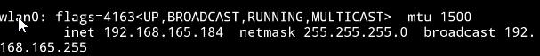

# Chapter7 抓包详解

    介绍http/https搭配抓包工具使用。

    应用层：http(s)抓包协议

    会话层：Socket通信抓包

## Http抓包配置

ifconfig指令查看设备ip,例如192.168.165.184：



ipconfig查看设备ip，例如192.168.165.10：


通过ping测试连通性：


给设备端设置手动代理，配置主机号和端口号：


注意，这种方式很容易被App代码检测或绕过，比如：

```java
System.getProperty("http.proxyHost");
System.getProperty("http.proxyPort");
```

相对于直接从应用层设置WLAN代理的方式，VPN代理则通过虚拟出一个新的网卡，从网络层加上该层代理，比较容易绕过。

这里用postern软件作为示例。

代理配置：


规则配置：


Burp Suite那边配置好监听端口后开启拦截：


Https 的方式我用Burp Suite解决了，尽管不如Fiddle Everywhere那么好用，磕磕盼盼还是勉强成功。

用 HTTP/HTTPS 代理用于 Web 流量调试，如果目标是 浏览器访问网页 → 拦截 & 修改 HTTP 请求/响应。

如果目标是 **一个应用程序通过 TCP socket 直接连服务器 → 想拦截流量， 用 SOCKS5 代理（比如游戏客户端、SSH、BitTorrent）**。

SOCKS5代理：
+ 代理只是 “转发数据” → 不懂 HTTP 协议
+ 不会解包 HTTP 内容 → 只是 TCP/UDP 转发
+ 更像是“隧道” → 抓不到 HTTP 协议结构
+ 用于抓 非HTTP协议 或 任何 TCP 流量


## 应用层抓包核心原理

中间人攻击（Man in the Middle Attack）就是， 客户端传送数据到服务端的中间过程中被一个在链路上的设备
抓取过滤甚至篡改，将完整客户端-服务端通信在客户端与服务端均无感知的情况下分割成客户端-攻击者和
攻击者-服务端两个通信阶段。

Https的整个通信流程被总结为4个阶段：发出请求、身份验证、协商密钥、加密通信。（PS：协商的session-key用于加密通信，节省开销）

为避免通过手动安装系统证书导致App被数据抓包，App推出了相应的对抗手段：
+ ssl pining， 也即客户端对服务端的加强校验，App连系统内置证书也不再信任而只信任App指定的证书。
  相应方法：直接Hook相应证书校验方法。
+ 服务端对客户端的加强校验。在服务端发送session key之前先对客户端的公钥进行校验，如果不是信任的公钥则中断。
  相应方法：由于在服务端，通过逆向分析拿到证书及证书密码，导入到Charles中，让服务端相信其就是客户端。
  


