# Hook 抓包实战

    上一章虽然展示如何使用Hook方式进行模拟抓包并且提供了一个通用的Hook方法来快速确定收发函数。

## 常见的网络通信框架

HTTP(S): 原生Android网络HTTP通信库主要使用HttpURLConnectoin和HttpClient两个类完成数据的发送和接收。
但是在Android6.0就取消使用HttpClient类，同时由于网络通信操作涉及异步、多线程和效率等问题，HTTPURLConnection
没有对此作封装，所以更多使用第三方网络通信框架。

WebSocket:实时通信，如在线聊天、游戏、股价更新。借鉴Socket全双工端对端通信的思想，全双工通信方式，长连接连接方式、
任意传输格式，建立前依赖HTTP握手，建立连接后客户端和服务端可互相主动发送消息。

XMPP(Extensible Messageing and presence Protocol, 可扩展与消息存在协议)：基于XML的通信协议，最初设计用于
及时通信。本质上也是长连接、双向通信，支持身份认证、状态显示、群聊、离线消息等功能。可通过XEP扩展功能，如文件传输、加密。


## 系统自带HTTP网络通信库HttpURLConnection

HTTPURLConnection的基本使用方式：

1. 新建URL对象，然后通过openCOnnection()函数获取HttpURLConnection实例。
```Java
URL url = new URL("http://www.google.com")
HttpURLConnection connection = (HttpURLConnection)url.openConnection()
```

2. 按照HTTP建立连接流程设置HTTP请求头和参数消息
```Java
connection.setRequestMethod("GET")
connection.setRequestProperty("token","55")
connection.setConnectionTimeout(5000)
connection.setReadTimeout(5000)
```

3. 调用getInputStream函数与服务器连接并获取返回的输入流，最后及时关闭
```Java
InputStream in = connection.getInputStream()

int bufferSize = 1024
byte[] buffer = new byte[bufferSize]
StringBuffer sb = new StringBuffer()
while(in.read(buffer)!= -1){
    sb.append(new String(buffer))
}

connection.disconnect()
```

4. 在manifest.xml中配置网络权限，运行后拿到谷歌的页面数据。

### HttpURLConnection自吐脚本开发

从上述使用HttpURLConnection的步骤中，我们可以看到：

+ URL类的构造函数
+ setRequestMethod和setRequestProperty设置请求头和请求参数等信息
+ getInputStream函数获取response

1. 先Hook整个URL类，然后使用watch class_method来Hook URL的构造方法。
```Frida
android hooking watch class java.net.URL
android hooking watch class_method java.net.URL.$init --dump-args --dump-backtrace --dump-return
```
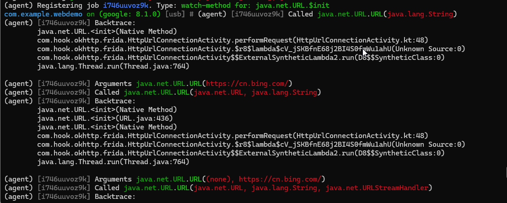

根据打印的堆栈来看，就选取调用栈最浅的java.net.ULR.$init(java.lang.String)函数完成自吐脚本。

```frida
frida -U -l urlstr.js com.example.webdemo
```

```javascript
function main(){
    java.perform(function(){
        var URL = Java.use('java.net.URL')
        URL.$init.overload('java.lang.String').implemention = function(urlstr){
            console.log('url => ' + urlstr)
            var result = this.$init(urlstr)
            return result
        }
    })
}
setImmediate(main)
```


打印的url地址如上图所示。

2. 根据上一步整理的关键收发包函数会发现剩下的都是HttpURLConnection类中的函数，于是对其整个类和构造函数进行Hook
```Frida
android hooking watch class java.net.HttpURLConnection
android hooking watch class_method java.net.HttpURLConnection.$init --dump-args --dump-backtrace --dump-return
```
结果发现只有构造函数和一个java.net.HttpURLConnection.getFollowRedirects()函数被调用了

使用以下objection命令获取HTTPURLConnection的实例时，发现不存在任何实例：
```Frida
android heap search instances java.net.HttpURLConnection

<!-- 使用wallbreaker插件搜索实例 -->
plugin wallbreaker objectionsearch java.net.HttpURLConnection
```

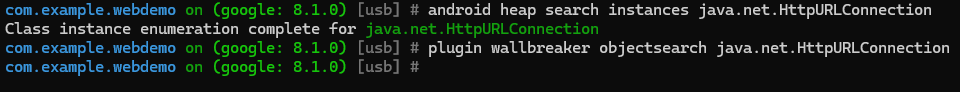

在Google官网API网站发现，这个HttpURLConnection类其实是一个抽象类。

如何确认在运行过程中抽象类的具体实现，可以采用以下两种方法：
- 纯逆向方法。通过Frida Hook打印出openConnection函数的返回值的类名result.$className
  或者用Objection Hook openConnection函数只不过发现类名的后面出现本次连接的网址字符串。

- 通过AS中debug功能在底部看到connect的类名。

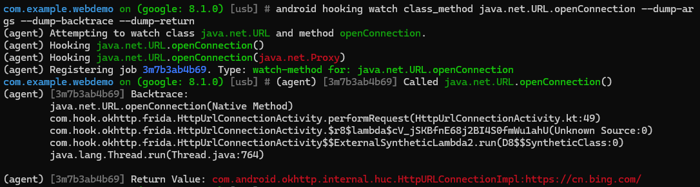

1. 根据上一步确认的HttpConnectionImp具体实现类后进行watch class
```Frida
android hooking watch class com.android.okhttp.internal.huc.HttpURLConnectionImpl
```

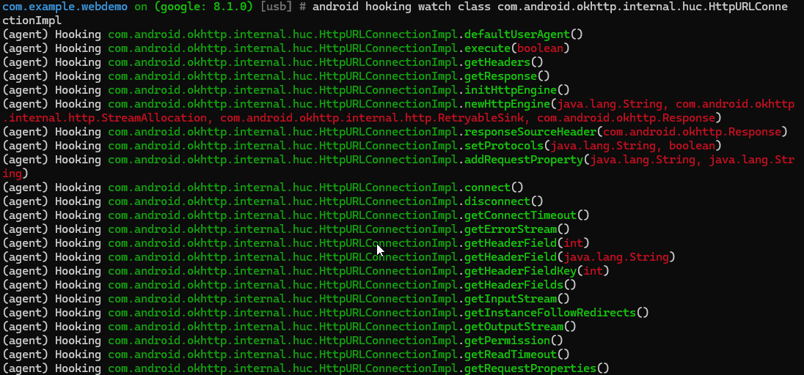

可以看到Demo使用额每个函数都被调用到了。

最终获取请求参数的自吐脚本：
```javascript
function main(){
    Java.perform(function(){
        var HttpURLConnectionImpl = Java.use('com.android.okhttp.internal.huc.HttpURLConnectionImpl')
        HttpURLConnectionImpl.setRequestProperty.implementation = function(key, value){
            console.log('setRequestProperty key: => ',key,',value:', value)
        }
    })
}
```

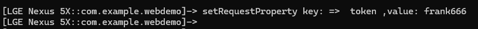

到这里HttpURLConnection的自吐脚本暂时开发完毕了，读者可以进一步开发，从而构成一个完整的网络通讯库自吐脚本。

### 第三方库okhttp3自吐脚本开发

首先，弄清楚okhttp3的使用流程。

1. 创建okhttpClient对象
```Java
OkhttpClient client = new OkhttpClient();
```
上述是默认的构造方法，它本身帮助我们自动配置了许多默认项如连接池、超时设置、重定向策略、缓存、ssl/tls配置、拦截器、代理设置等等

2. 创建Request对象
包括请求url、请求头、请求体等等都在request对象中设置，通过建造者模式进行创建。

3. 发起网络请求
```Java
client.newCall(request).enqueue(new Okhttp.Callback(){
    public void onFailure(){
        ......
    }

    public void onSuccess(){
        ......
    }
})
```

我们关注几个方面，请求网址、请求头、请求体以及响应消息，现在newCall函数传入的request对象能自吐出前3项。

因此，我们先对该方法进行hook

```Objection
android hooking watch class_method okhttp3.OkHttpClient.newCall --dump-return --dump-backtrace --dump-args
```

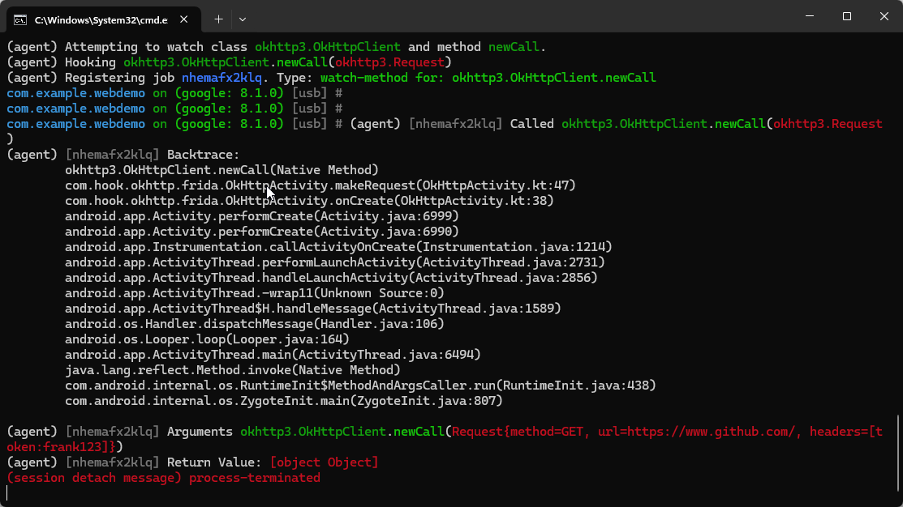

结果打印出了接收request对象的函数调用栈，可以看到newCall方法中传入的request对象的数据信息

接下来使用frida进行hook打印，

```javascript
function main(){
    Java.perform(function(){
        var OkHttpClient = Java.use("okhttp3.OkHttpClient")

        OkHttpClient.newCall.implementation = function(request){
            var result = this.newCall(request)
            console.log(request.toString())
            return result
        }
    })
}
```

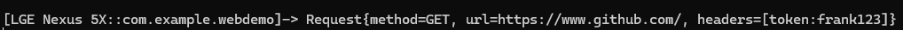

根据打印结果你可以看到Frida注入目标App后的执行结果。观察结果，发现request的自吐脚本基本开发完毕。

> [!CAUTION]
> 实际上，Hook Request的问题远没有完美解决，此Hook同样可能遗漏或多出部分请求，因为存在Call后没有发出实际请求的情况。

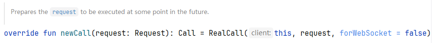

我们继续回头看newCall()函数的实现，会发现newCall()函数调用了RealCall.newRealCall()函数（java语言是这样，图中
是kotlin语言下的newCall函数，它返回一个RealCall对象）。

newRealCall()函数创建了一个新的RealCall对象，RealCall对象是okhttp3.Call接口的一个实现，也是okhttp3中Call的唯一实现，
表示一个等待执行的请求且只能被执行一次。实际上，到这一步请求依然可以被取消。

因此，只有Hook了execute()和enqueue(new Callback())才能真正保证每个从okhttp出去的请求能被Hook到。

> [!CAUTION]
> 该方法割裂请求与相应分开去找Hook点，只能看到request，无法同时看到response.可以采用okhttp拦截器Interceptor来解决。

拦截器原理：最上层的拦截器向下传递一个request，并请求下层拦截器返回一个response，下层的拦截器收到request继续向下传递，
并请求返回一个response，直到传递最后一个拦截器，它对这个request进行处理并返回一个response，然后这个response层层向上
传递，最终传递到最上层。这样最上层的拦截器就得到了response，整个过程形成了一个拦截器的完整递归调用链。

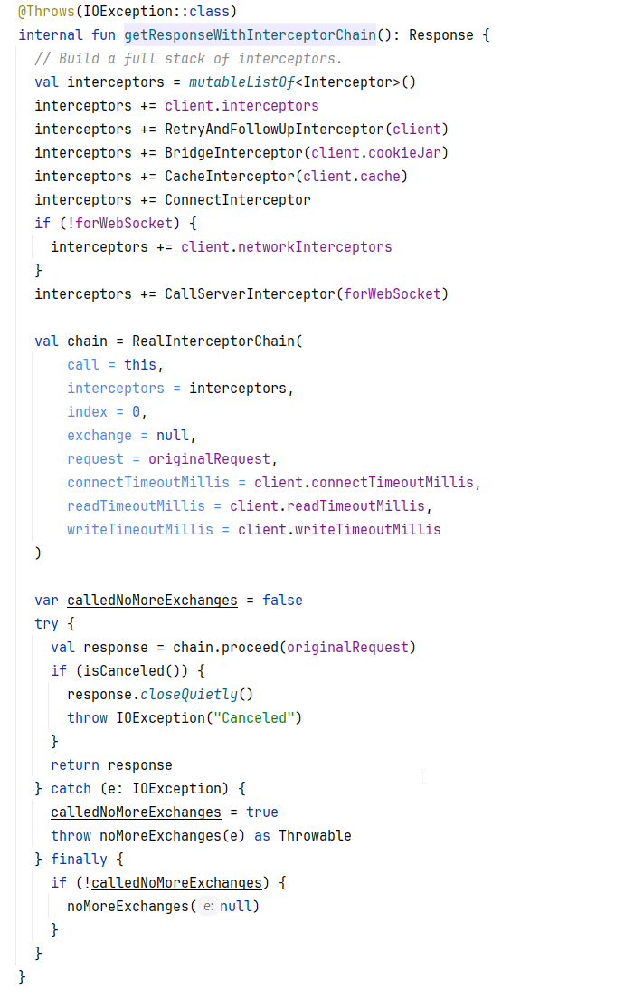

* interceptors : 空的拦截器容器
* client.interceptors : 用户自定义的应用拦截器集合
* RetryAndFollowUpInterceptor(client) : 用于取消、失败重试、重定向
* BridgeInterceptor(client.cookieJar) : 对于Request，把用户请求转为HTTP请求；对于Response，把Http相应转换为用户友好的响应
* CacheInterceptor(client.cache) : 用于读写缓存、根据策略决定是否使用
* ConnectInterceptor : 实现和服务器建立连接
* CallServerInterceptor : 真正发起网络请求的Interceptor

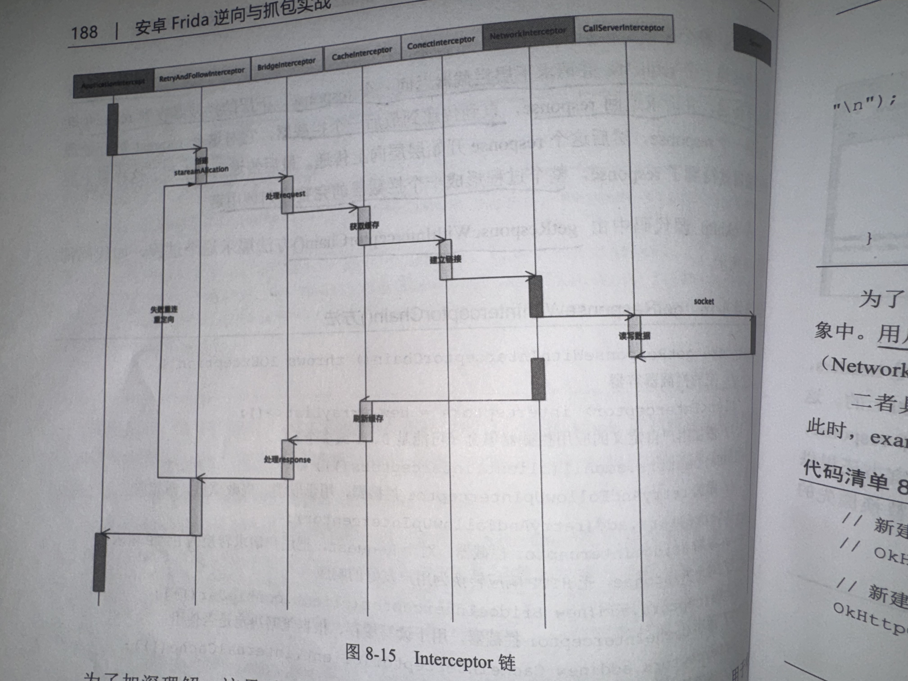

### 给OkHttpClient添加用户自定义拦截器

自定义LoggingInterceptor拦截器纸打印URL和headers，用户自定义拦截器主要有两种：应用拦截器和网络拦截器。

修改okhttpClient创建方式，其有三种方式：

1. 默认参数
2. Builder建造者模式
3. 在原有okclient对象基础上创建一个新的okhttp客户端

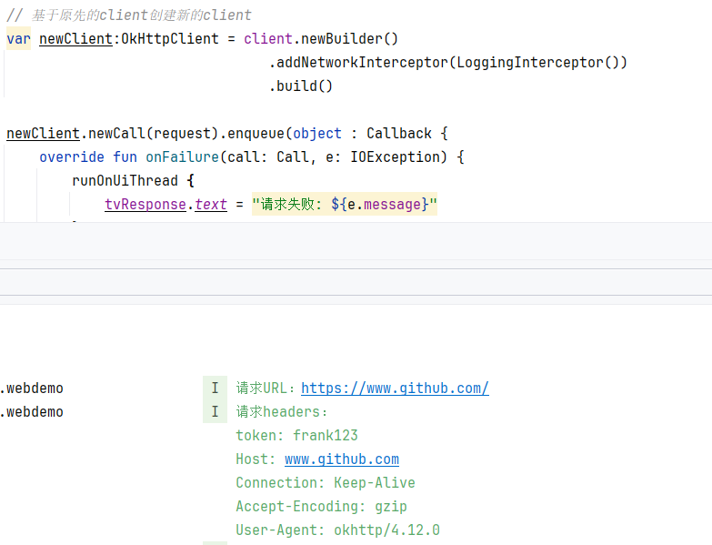

根据官方okhttp-logging-interceptor可以写一个更详细的LoggingInterceptor.

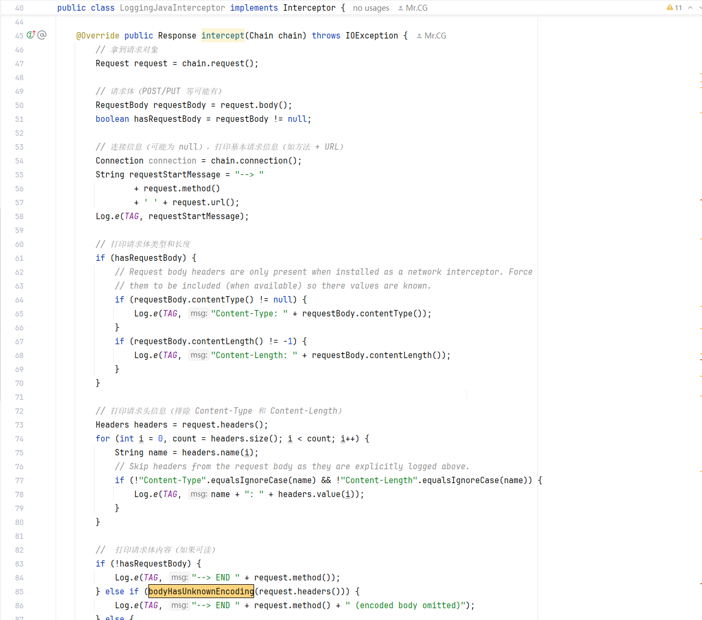

为了将这个Hook方案推广到其他使用okhttp框架的App上，可以直接把这部分代码编译成DEX注入到其他应用中。

Frida可以通过如下API将DEX加载到内存中，从而使用DEX中的方法和类。 

```
Java.openClassFile(dexPath).load()
```

> [!TIP]
> Kotlin/Java 源码 编译成 .class 字节码文件，Android 不运行 JVM 字节码，它使用 Dalvik（旧）或 ART（新），
> 所以.class 文件需要被转换为 .dex（Dalvik Executable）文件。多个 .class 会合并成一个 .dex文件。
> .dex 文件是机器运行用的，但我们无法直接读懂，所以我们用反编译工具（如 baksmali）把 .dex → .smali。.smali 是 Dalvik 字节码的一种类汇编语言。

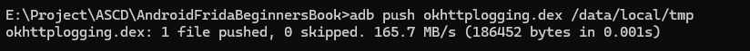

运行上述App后，在build目录下找到对应apk文件，对文件进行解压后得到classes.dex文件，更名为okhttp3logging.dex,
并将其推送到测试手机的/data/local/tmp目录下。

```javascript
function hook_okhttp3(){
    Java.perform(function(){
        //加载目标dex
        Java.openClassFile("/data/local/tmp/okhttplogging.dex").load()

        var MyInterceptor = Java.use("com.r0ysue.learnokhttp.LoggingInterceptor")
        var MyInterceptorObj = MyInterceptor.$new()

        var Builder = Java.use("okhttp3.OkHttpClient$Builder")
        console.log(Builder)

        Builder.build.implementation = function(){
            this.networkInterceptors().add(MyInterceptorObj)
            return this.build
        }
        console.log("hook_okhttp3...")
    })
}
```

由于client在app启动较早时期创建，所以最好使用spawn模式Hook。

```
frida -U -f com.example.webdemo -l hookInterceptor.js --no-pause
```

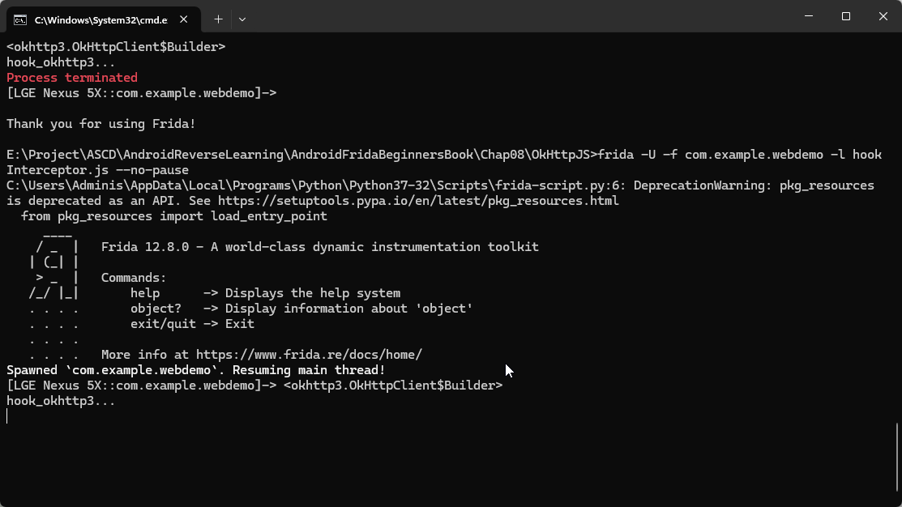


